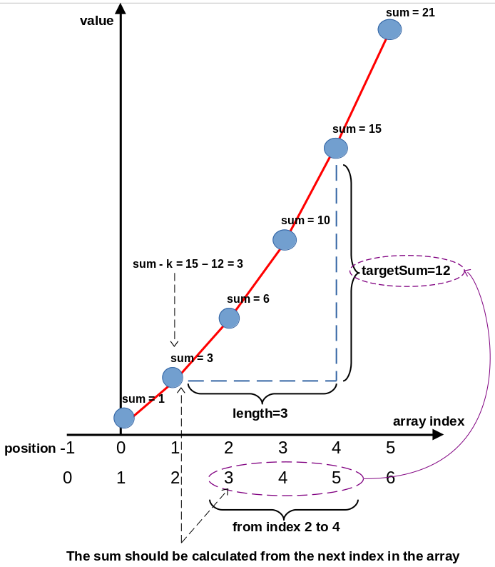

# algorithm No. 16

> This algorithm is the hash map approach for finding the maximum subarray sum with a target sum value

## Example for the unit test

This diagram explains that the first example in the unit test uses a simple array of integers to calculate the maximum subarray length with a given sum.

 