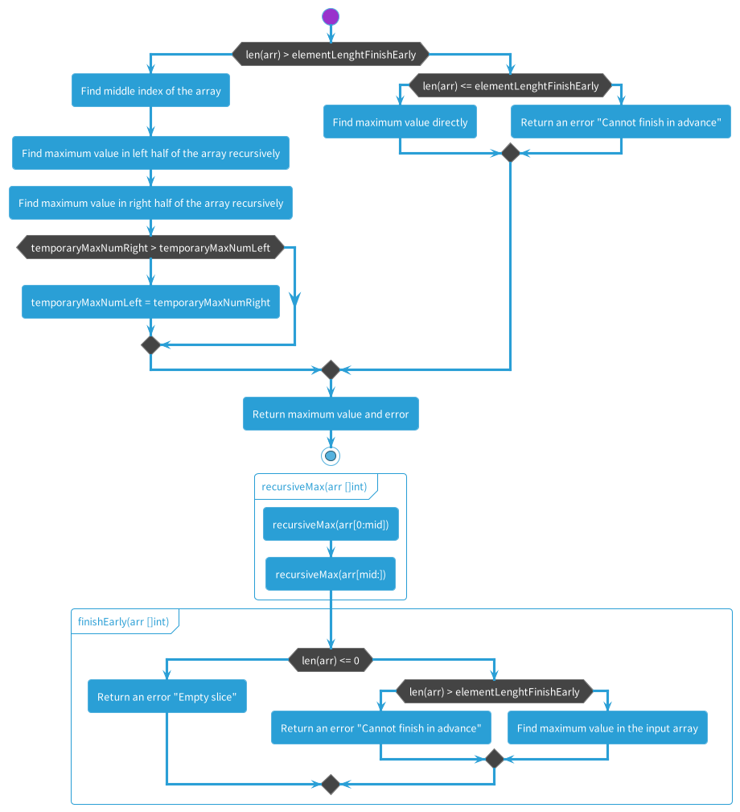

# algorithm No. 20

## Example for the unit test

The flow of the program is approximately as follows:

- The **recursiveMax** function is called repeatedly, and each time the **finishEarly** function is used to check if the number of elements is less than or equal to 3.
- If it is, the function finds the maximum value by examining each element of the slice and returns it, terminating early.
- This process continues until the final maximum value is found.

 

