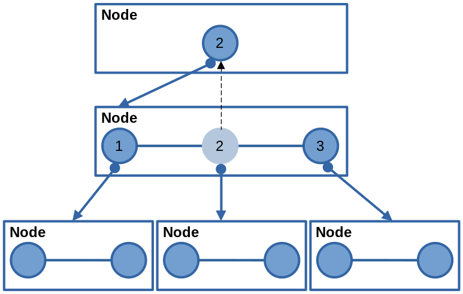
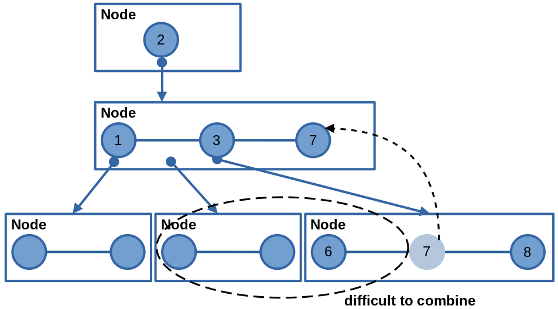
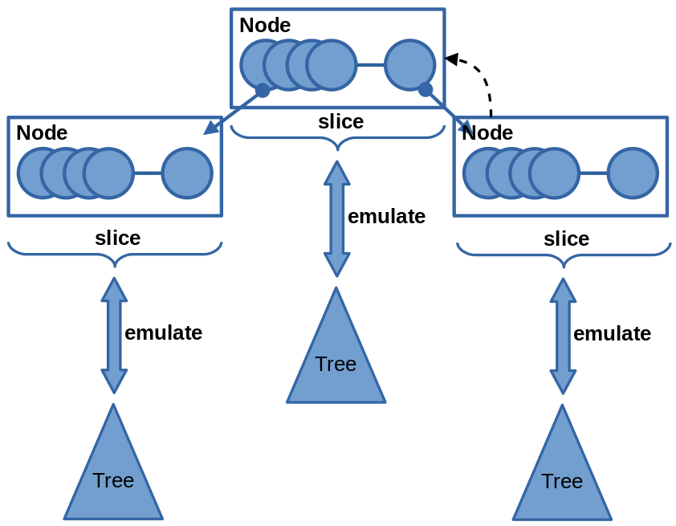
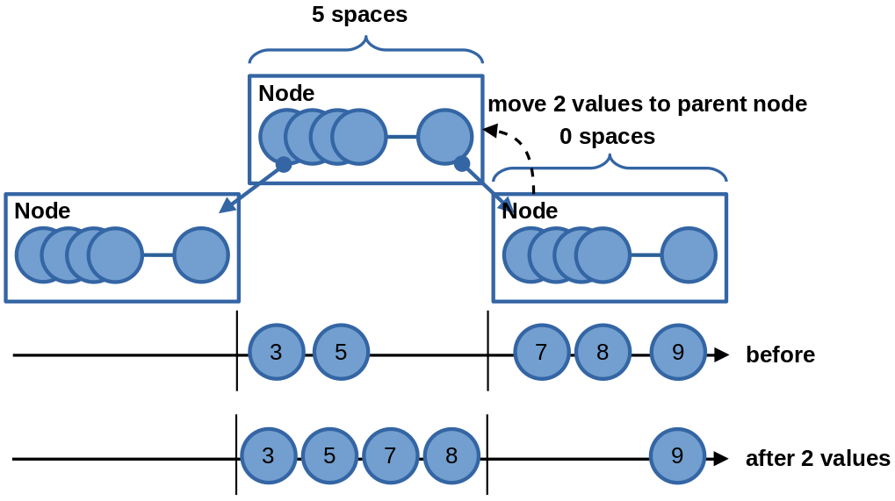
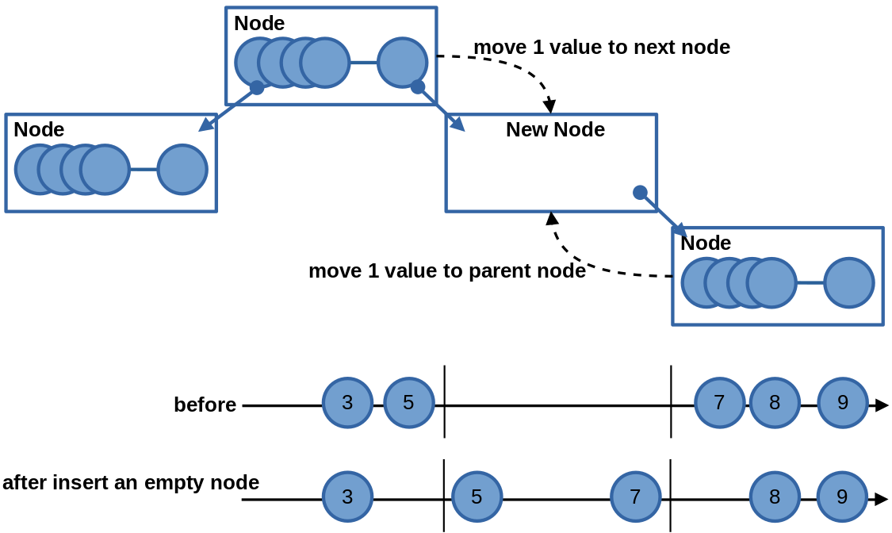
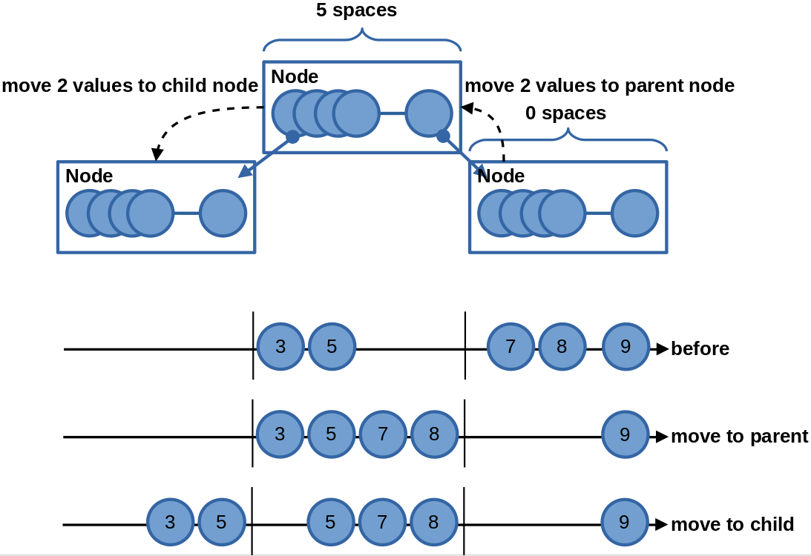
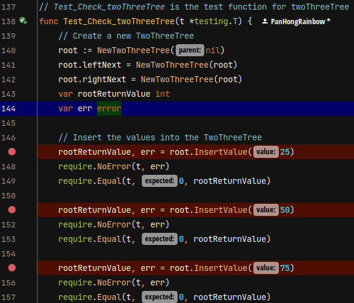
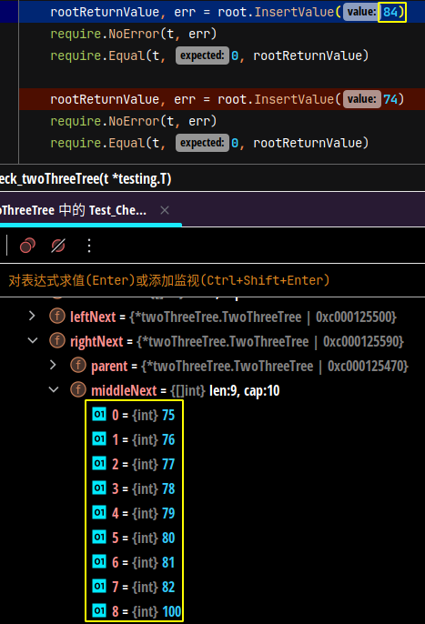
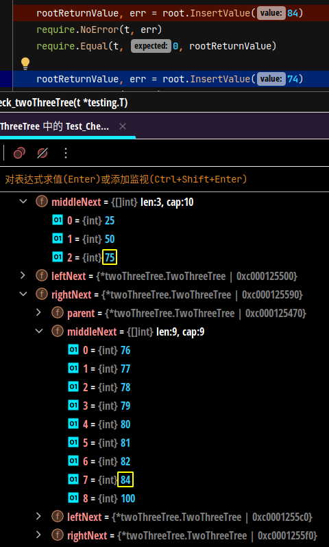
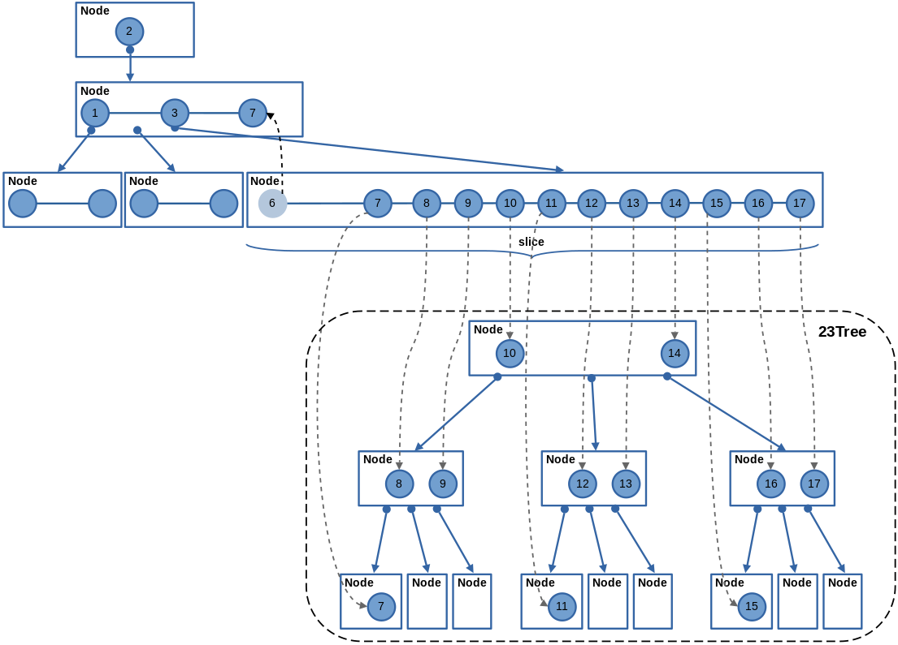

# Two-Three Tree

> `2-3 tree` is the most original version of `red-black tree`.
> However, because 2-3 tree is too difficult to implement, red-black tree was created.
> `Red-black tree` uses a `two-color binary tree` to simulate `2-3 tree`.

## Introduction

The definition of a `2-3 tree` is that a node can only store `two values` and can have `at most three child nodes`.

## Difficulty

There are the following difficulties in implementing a 2-3 tree.

1. A node can only store `2` values.
   When it stores up to `3` values, it `pops out` the `middle value` to `the upper layer`.
   At this time, it needs to `refresh the structure` and `merge the child nodes`.
   For example, when `popping out 2`, it needs to restructure. At this time, `2 forms a new node`. 
   When `popping out 7`, it needs to `merge 2 next nodes` at the upper layer.
   The operation is `very complicated`.
    
2. In addition, it needs to move to the `new root node` in order to `keep the length of all child nodes the same`, `rotate the whole node`, and restructure the whole structure.
   It is also a very difficult operation.

## Simplify

The simplification method is as follows: `first simplify the middle child node of the 2-3 tree`.

1. A node can store not only 2 values, but `multiple values`, such as a slice of 10 values.
   It `gathers all the values of the middle child node` in this `slice`.
2. Now use a slice of 10 values to replace the middle child node.
   In the future, use other trees to replace this slice, and `complete the whole 2-3 tree`.
3. When a node is full of ten values, it can `easily move to other nodes` when `popping out values`.
    
4. When `adding an empty node`, it can also `easily form a new node`.
   
5. It can also `easily rotate nodes` and `generate a new root node`.
   

## Operation

First set a breakpoint and `observe the situation of adding values` to the 2-3 tree.

 

`Before` inserting the value `84` into the 2-3 tree.

 

`After` inserting the value `84`, `75 will pop out` and insert into the `upper parent node`.

 

## New writing strategy

> The `2-3 tree` is the mother of many trees, and many trees are inspired by the `2-3 tree`, but who invented it?
>
> It is too difficult to implement because the 2-3 tree is hard to `rebalance`. 

In my opinion, these adjustments are necessary. 

1. When I wrote `the 2-3 tree`, I wanted to `simulate it with slices` and `actively balance the 2-3 tree`.
2. `The 2-3 tree` will pop up `the middle value` upwards, but I want to `change it` to pop up the values on `both sides`, because this can `rebalance the entire 2-3 tree structure easily`. 
3.  I need to write a function to convert `the 2-3 tree into slices` and `the slices into the 2-3 tree`.
4. During the conversion process, consider using a `position array` to replace the key node -> *node and `see if the performance will be better`.

