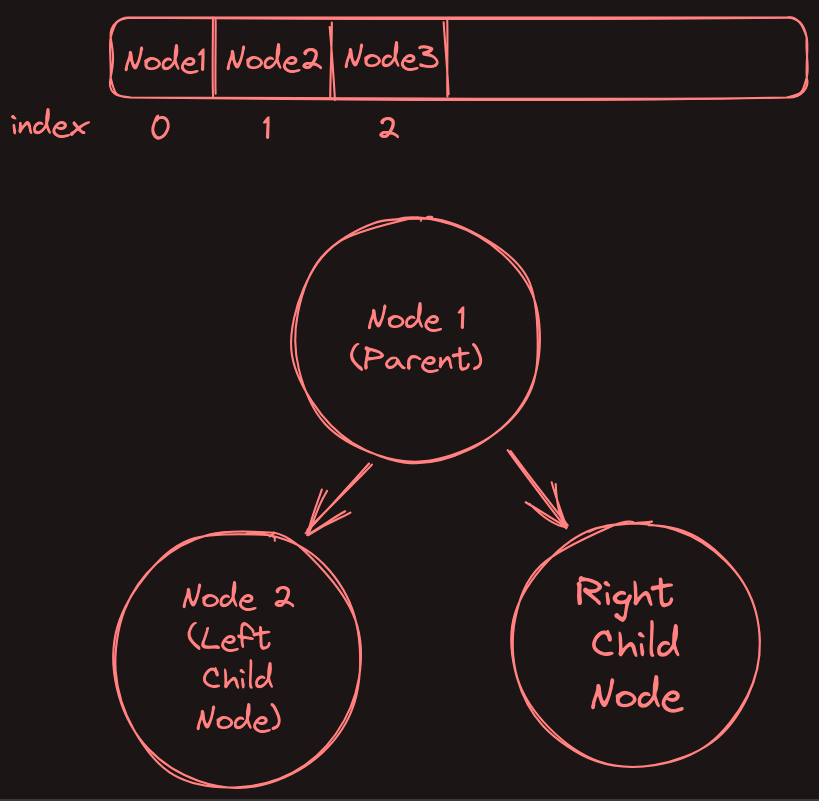
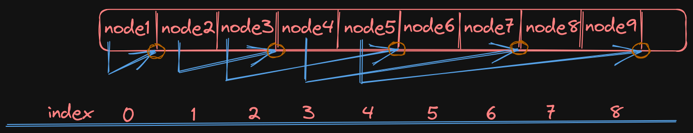
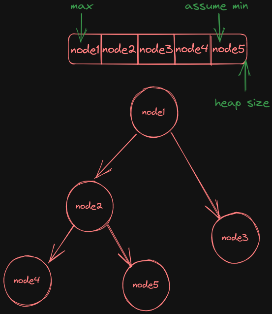
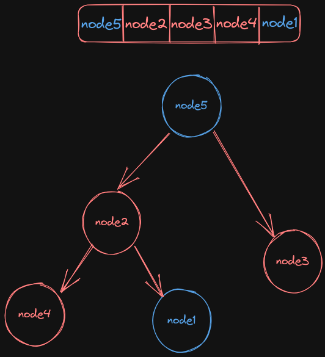

# Operation of Max Heap

## Parent and Child Nodes

A maxheap has `all nodes within a slice`, and each node has `a parent-child relationship`.

The parent node's index can be used to deduce the index of its two child nodes.

The formula is as follows:
$$
formula\ 1:\ index_{left\ child\ node} = 2 \times index_{parent\ node} + 1 \\
formula\ 2:\ index_{left\ child\ node} = 2 \times index_{parent\ node} + 2 \\
$$
For Example:

If the index of the parent node is 0, substituting into formulas 1 and 2 yields 1 and 2, respectively, This corresponds to the illustration below.

 

Why do we `multiply by 2 and add 1 or 2` in those formulas?

## Explanation of the Formula

Multiplying by 2 is used to locate the index, while `adding 1 or 2` serves as `an offset`.

(乘以2是索引，加1 加2是偏移量)

By observing `the circled section` in the diagram below, it's evident that `the child nodes consistently increase by a factor of 2`.

(圈起来部分，子节点2个等距增加，乘2合理)

Therefore, multiplying by 2  Therefore, multiplying by 2 is a logical choice.

## Maximum Value and Down Shift

> Because the goal is to ensure that `the maximum value is in the parent node`, the process of extracting the maximum value involves a `downward shift`.

The entire process of selecting the maximum value and shifting downwards.

In the initial state, `there are five nodes`, with `node1 being the maximum value` and `assuming node5 to be the minimum value`.

Here, node1 is the maximum value, and node5 is the `assumed` minimum value.

`The minimum value` of the max heap `may not necessarily be at the end of the slice.`

The heap size is `5.`

  

When operating on a max heap, it's necessary to first `swap node1 and node5.`

This is because we want to `move the maximum value, node5, to the end of the slice.`

(最小值并不一定会在切片的取后面)

  

Retrieve the maximum value, node1, from the max heap.

 

 

