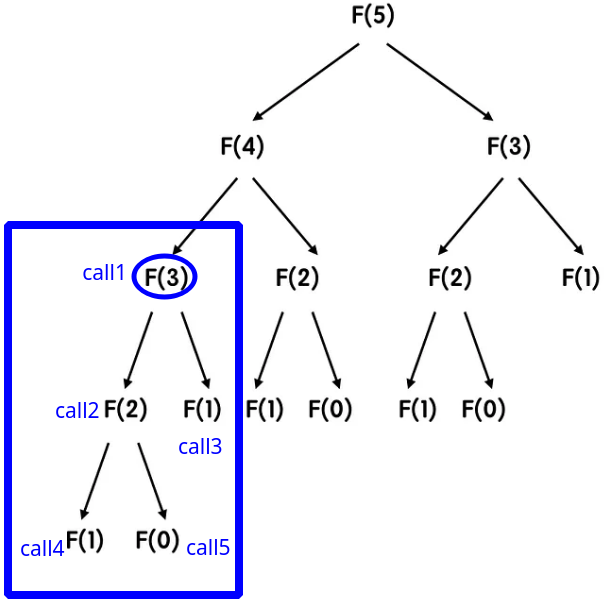

# Time Complexity

The time complexity of an algorithm uses a rough estimate of the execution time needed, which can be used to estimate `the upper bound of the program's running time`.

## Comparing Algorithms

When comparing algorithms, first compare `the communication complexity` and `I/O complexity`, then `the time complexity`, and finally `the space complexity`, because communication and I/O have very high costs.

先比较 `1 通信复杂度` 和 `2 IO复杂度`,然后是 `3时间复杂度` ,最后是 `4空间复杂度`

## Time Complexity List

Below is a comparison of the time complexities of different programs:

### Three Nested Loops

Many say the time complexity of three nested loops is `O(n^3) = n1 * n2 * n3 = n * n * n`.

But this `assumes each loop iteration is proportional to n`. (每层要和 n 成正比才行)

If the first loop iterates 10 times, the time complexity becomes 
` O(n^2) = n1 * n2 * n3 = 10 * n * n = 10 * n^2`

#### Time complexity of three nested loops:

Let T(n) be the number of executions of the three loops, and n be the input size.

##### Base Case：

When `n = 1`, each loop executes 1 time, so `T(1) = 1` holds.

Also assume for any k, `T(k) ≤ k^3 holds when n = k`.

##### Inductive step：

When `n = k+1`, the outer loop executes k+1 times, middle loop executes k+1 times, and inner loop executes k+1 times.

So `T(k+1) ≤ (k+1)^3` also holds.

##### Induction conclusion：

Therefore, `for any n, T(n) ≤ n^3 holds`, so the time complexity of three nested loops is `O(n^3)`.

### Binary search

The time complexity of binary search is ``O(log n)`, where log is `base 2`.

We now prove this:

#### Time complexity of binary search:

Let `T(n) be the number of comparisons needed for binary search` on an array of size n.

(T(n) 为执行二分法需要比较的次数)

##### Base Case：

If the array size is 1, i.e. n=1, only one comparison is needed, so `T(1) = 1`      **(1st basic formula)**

##### Inductive step：

Assume `T(k) ≤ log k` holds when `n=k`     **(2nd hypothesis formula)**

When n=k+1, binary search divides the array into two halves of size k/2, and continues searching in one half.

So `T(k+1) = T(k/2) + 1`     **(3rd basic formula)**

##### Induction conclusion：

Starting from **the 3rd basic** formula:

**T(k+1) = T(k/2) + 1**

Substituting the **2nd hypothesis formula T(k) ≤ log k**: 

`T(k+1) = T(k/2) + 1 ≤ log(k/2)k + 1`      **(4th extended formula)**

Further deducing:

`T(k+1) ≤ log(k/2)k + 1 = log(k) - log(1/2) + 1 = log(k) - 1 + 1 = log(k)`     **(5th extended formula)**

In summary:

`T(k+1) ≤ log(k)`     **(6th extended formula)**

From the **6th extended formula**, we can see that assuming **T(k) ≤ log(k)**, we in fact have **T(k+1) ≤ log(k)** as well.

##### Induction conclusion：

Therefore, for any n, we have T(n) ≤ log n.

Thus the time complexity of binary search is O(log n).

This is because we `have proven the case for n+1, and the base case of n=1 also holds`.

After that, taking `n=base case 1 + 1 = new case 2` also holds.

Taking `n=new case 2 + 1 = new case 3` also holds.

`And so on.`

So by mathematical induction, we have proven t`he time complexity O(log n) holds for all n`. 

因为我们已经证明n+1已经成立,而且有基础情况1也成立,
之后取n=基础情况1+1=新情况2也成立,
之后取n=新情况2+1=新情况3也成立,
等等
由此通过数学归纳法证明了对任意正整数n,结论都成立。

### Recursive

> The time complexity of each recursive function varies.
>
> Here, we use the `Fibonacci function` as an example.

The time complexity of recursive is `O(2^n)`.

We now prove this:

#### Time complexity of recursive:

Let ` T(n) represents the number of recursive function calls`.

(T(n) 为递回函式的呼叫次数)

##### Base Case：

If  the Fibonacci input is `0`, i.e. n=0, then `T(0) = 1 ≤ 2^0` 

If the Fibonacci input is `1`, i.e. n=1, then `T(1) = 1 ≤ 2^1` 

If the Fibonacci input is `2`, i.e. n=2, then `T(2) = 3 ≤ 2^2` 

If the Fibonacci input is `3`, i.e. n=3, then `T(3) = 5 = 2^3`      **(1st basic formula)**

 

(当输入为 3 时，会呼叫 5 次)

The idea is as follows:

`the time complexity` is `the upper bound of the number of executions`.

For the Fibonacci function, when the inputs are `0, 1, 2, and 3`, the number of recursive calls is `1, 1, 2, and 4`, respectively, all within `the upper bound of 2^k`.

(时间复杂度为执行的次数上限，以费氏函数来说，都在 2^k 的上限范围内)

When the input is n, `the maximum number of levels of execution will not exceed n`, so the upper bound of execution is determined to be 2^n.

(当 input 为 n 时，`最多执行的层数不会超过 n 层`，所以执行的上限为 2^n，就是这样定出上限的)

##### Inductive step：

Assume `T(k) ≤ 2^k` holds when `n=k`     **(2nd hypothesis formula)**

When `n=k+1`, the Fibonacci sequence needs to `separately calculate the results of F(k) and F(k-1)`.

So `T(k+1) = T(k) + T(k-1)`     **(3rd basic formula)**

##### Induction conclusion：

Starting from **the 3rd basic** formula:

**T(k+1) = T(k) + T(k-1)**

Substituting the **2nd hypothesis formula T(k) ≤ 2^k**: 

`T(k+1) = T(k) + T(k-1) ≤ 2^k + 2^(k-1) = 2^k * (1 + 1/2)`      **(4th extended formula)**

Further deducing:

``T(k+1) = 2^k * (1 + 1/2) = 3/2 (2^k) = Big_O(2^k)`     **(5th extended formula)**

In summary:

`T(k+1) ≤ 2^k`     **(6th extended formula)**

From the **6th extended formula**, we can see that assuming **T(k) ≤ 2^k**, we in fact have **T(k+1) ≤ 2^(k)** as well.

##### Induction conclusion：

Therefore, for any n, we have T(n) ≤ 2^n.

Thus the time complexity of recursive is O(2^n).

This is because we `have proven the case for n+1, and the base case of n=3 also holds`.

After that, taking `n=base case 3 + 1 = new case 4` also holds.

Taking `n=new case 4 + 1 = new case 5` also holds.

`And so on.`

So by mathematical induction, we have proven t`he time complexity O(2^n) holds for all n`. 

因为我们已经证明n+1已经成立,而且有基础情况1也成立,
之后取n=基础情况3+1=新情况4也成立,
之后取n=新情况4+1=新情况5也成立,
等等
由此通过数学归纳法证明了对任意正整数n,结论都成立。

https://zhuanlan.zhihu.com/p/320419705 
